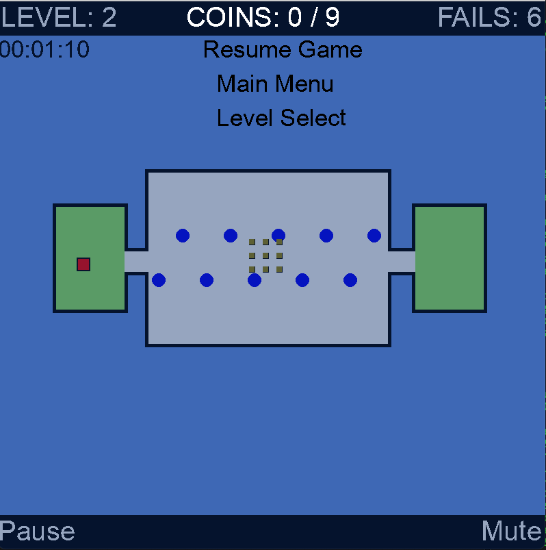

# World's Hardest Game
This is my attempt to clone some levels from the World's Hardest Game using Python and Pygame. 


## Installation

### Prerequisites
- Python version 3.9 or greater 

### Steps

1. Clone the repository:

    ```sh
    git clone https://github.com/Brady-Brandt/WorldsHardestGame.git
    cd WorldsHardestGame
    ```

2. Install the required packages: (Pygame 2.0)

    ```sh
    pip install -r requirements.txt
    ```

3. Run the game:

    ```sh
    python main.py
    ```

## Gameplay 
Navigate with the arrow keys or wasd to the end of the level while collecting all coins and dodging the blue balls. 


### Images 
 
##
 
##
 
##
 

